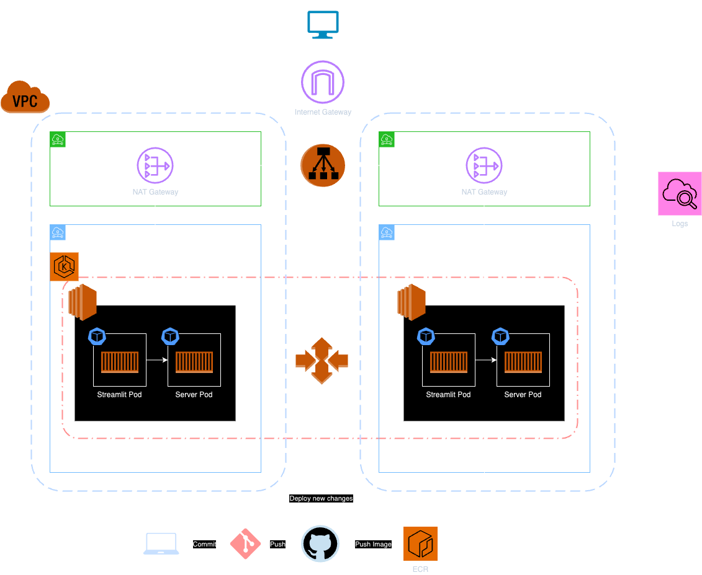

# TextBot

A foundational Language Model (LM) designed for sentence completion has been developed. Its frontend is built using Streamlit, while the backend employs FastAPI, integrating various AWS resources such as ECR, EC2, EKS, ALB, IAM, VPC, EIP, NAT Gateways, Internet Gateway, and Route Tables. All of these are configured using Terraform and deployed on AWS infrastructure. This setup is enhanced by a Continuous Integration/Continuous Deployment (CI/CD) pipeline powered by GitHub Actions. The pipeline optimizes processes such as automated image creation, image tagging linked to the latest commit ID, pushing images to ECR, updating deployment YAML files, and seamlessly implementing changes across the EKS cluster.

## Low Level Design

## High Level Design

