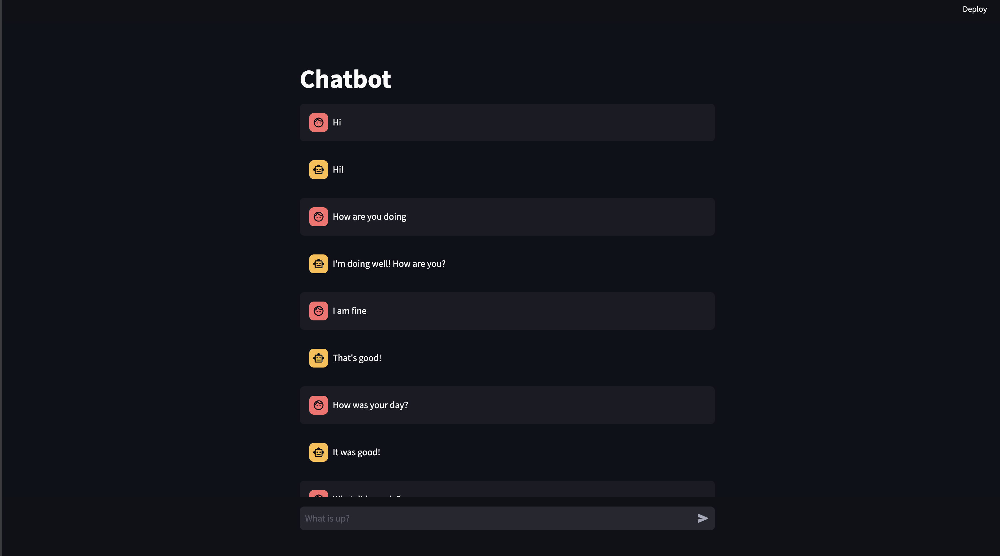
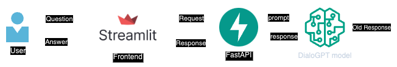
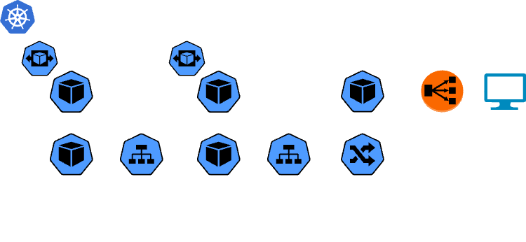
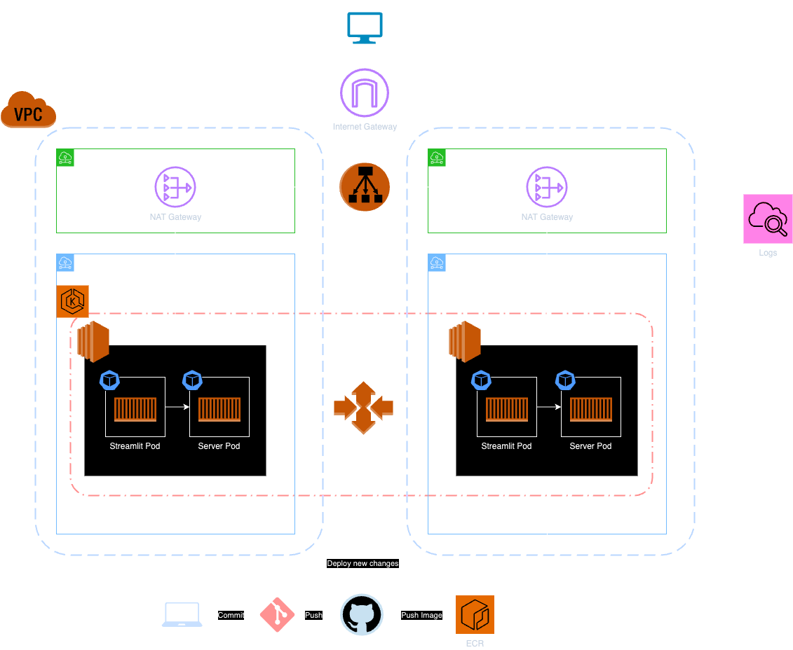

# Chatbot

Designed and deployed a simple chatbot utilizing Large Language Models (LLMs) on Amazon EKS using Terraform, while also implementing CI/CD pipelines for streamlined development and deployment.

## Frontend

## Model Level Design

## Low Level Design

## High Level Design

