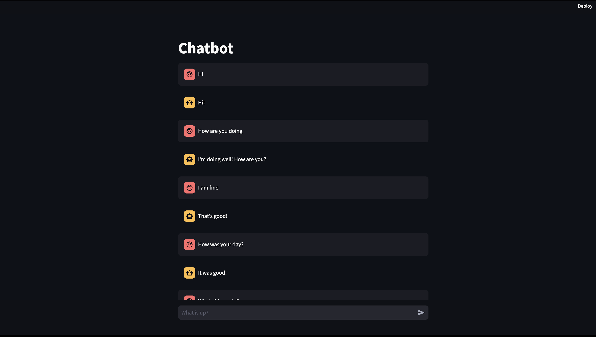

# Chatbot

Designed and deployed a simple chatbot utilizing Large Language Models (LLMs) on Amazon EKS using Terraform, while also implementing CI/CD pipelines for streamlined development and deployment.

To know more details reagrding the project, kindly refer to this Medium [blog](https://medium.com/@anirudhsridhar1905/deploying-a-large-language-model-application-on-amazon-eks-53c375e83f92).

## Frontend

## Model Level Design

## Low Level Design

## High Level Design

